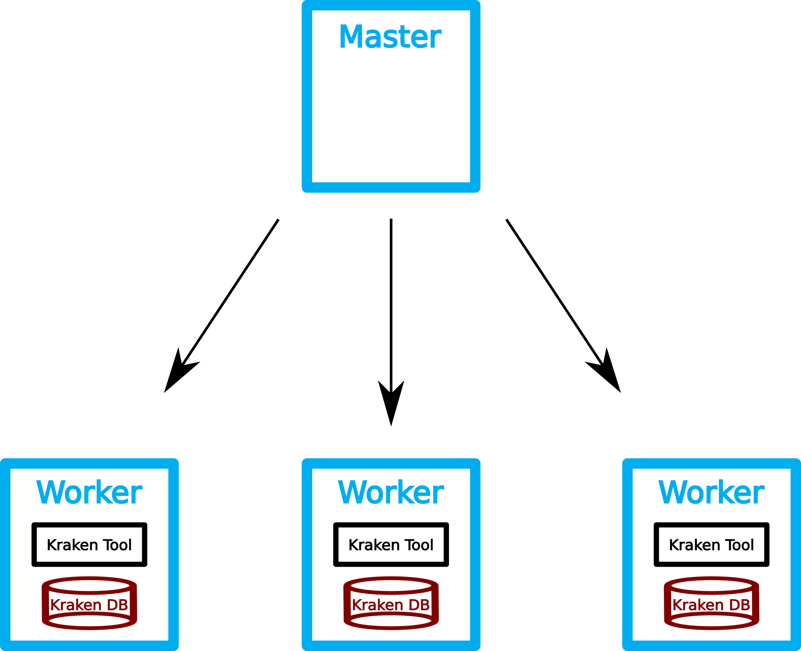

# eMed Docker-Kraken Demo

We want to use [Kraken](https://ccb.jhu.edu/software/kraken/) to analyze some FASTQ files from the [Human Microbiome Project](http://hmpdacc.org) and use [Krona](https://github.com/marbl/Krona/wiki) to visualize the results. To makes the life easier we run ready-to-use dockerized versions of Kraken and Krona.

## Prerequisites
We assume that a [bibigrid](https://github.com/BiBiServ/bibigrid) cluster ( master - 8 cores + 4 worker nodes - 16 cores each) with a configured GridEngine (GE) is already running.
Please fetch this repository with

	git clone https://github.com/pbelmann/eMed.git
   	
*Hint: The cloud users homedir* ***is not shared*** *between master and host. Any outputs from GE jobs are stored in users homedir as default. It is often a good idea to change this default behavior. We could change the environment setting of the GridEngine or just use the -cwd (Currrent Working Directory) argument and change into a shared fs before*

	cd /vol/spool/log
	qsub -cwd ...

## Kraken Docker Image

[BioContainers](http://biocontainers.pro) is an open source container framework for bioinformatic software. We search BioContainers registry for a suitable Kraken container and write a small shell script that downloads the container once on each compute host. We can use the GE to distribute the jobs on the
cluster. The `-pe` option ensures, that we call the script only  **once on each host**.

	qsub -t 1-4 -pe multislot 16 -b y docker pull quay.io/biocontainers/kraken:1.0--pl5.22.0_0
	
*This step seems to be unneccessary, because docker pulls a container if it isn't locally available. However, separate this step from rest of pipeline can speed up a analysis in the case you run more than one job in parallel on one host.*

## Running Kraken containers on the cluster nodes

### Download Kraken Database

First we need to download the Kraken database to each of
the hosts. For usage with Kraken the database must decompressed before usage. Both actions are implemented in a shell script named `kraken_download_db.sh`. 

We again use the GridEngine to distribute the script on all slave hosts.

	qsub -t 1-4 -pe multislot 16 kraken_download_db.sh

### Run Kraken Analysis

For the kraken analysis we have to use a shell script `kraken_pipline.sh` that should do the following :

1. Download FASTQ file.
	- the object storage contains a set of fastq files.
	- Use `wget`  to download them to local storage (`/vol/scratch`)
	
2. Run Kraken.
 - FastQ files are compressed (tar.bz2) : `--fastq-input`
 - mount input data and database path into the container
  	
3. Create Kraken report.

	SEQ_FILES=$(curl -s https://openstack.cebitec.uni-bielefeld.de:8080/swift/v1/eMed/ | grep tar.bz2 )
	for SF in ${SEQ_FILES}; do 
		SRS_NR=$(echo $SF | cut -f 2 -d '/' | cut -f 1 -d '.' ); 
		qsub -pe multislot 16 kraken_pipeline.sh $SF $SRS_NR.report ; 
	done 	
    
### Generate Krona plot

We now use [Krona](https://github.com/marbl/Krona/wiki) to get a nice visualitation of our results. Again search for a suitable container containing the Krona software suite or build a Krona container by yourself, the hands-on repository contains a suitable Dockerfile.

***Attention: Unfortuneatly the krona container offered by `biocontainers.pro` does not come with a preinstalled taxonomy database and the contained updateTaxonomy.sh script breaks because of a missing dependency (curl).***

### Build Krona container

	cd eMed
	docker build -t krona .

### Merge all report files
Since all reports files located on a shared filesystem, Krona can be run directly on the master. We have to merge all kraken-reports ...

    cd /vol/spool/kraken
    for i in *.report; do cut -f2,3 $i > $i.krona; done
    
### Run krona  
    
    cd /vol/spool/kraken
    docker run -u 1000:1000 -v /vol/spool/kraken:/data krona ktImportTaxonomy *.krona -o krona.html
    
### View the results

     mv krona.html* /vol/spool/www
    
You can use your browser to look at the Krona output.

     http://<BIBIGRID_MASTER_IP>/result/krona.html
